# Machdyne PNP - Eins - Assembly Guide

## Overview

This guide will walk you through the process of assembling the pick-and-place machine "Eins".

If you have all of the parts pre-printed, it may be possible to build the machine in a day, but the instructions are presented in a way that will also allow you to build the machine incrementally over several days, printing parts as you go, and will allow you to test portions of it before moving forward.

This guide references [3D-printed parts](https://github.com/machdyne/pnp/tree/main/machines/eins#parts) and items from the [Bill of Materials](https://github.com/machdyne/pnp/tree/main/machines/eins#bill-of-materials).

## Step - Prepare the table.

We used an Ikea INGO (120x75) pine table, treated with beeswax. Keep in mind that you will need to cut a hole in the table and drill holes into it. You can use a smaller or larger table, but you may need to adjust the frame and rail sizes.

## Step - Attach the Y axes to the table.

The Y axis is built with the two shorter lengths of aluminum extrusion.

Each Y axis extrusion is attached to the table with two `xytm` (X+Y Table Mount) parts, one at each end.

You can use the longer extrusions to help keep the Y axes aligned in parallel. The longer extrusions will be attached later to form the complete rectangular frame.

We centered the frame on the table, but you could also choose to offset it to one side.

The four `xytm` parts are attached to the table with M5 bolts and nuts. It is sufficient to use only one bolt per `xytm` part. Use a pencil to mark the holes for drilling, once you're satisfied that the frame is square.

The Y axes will be attached to the side of the `xytm` parts with M3 bolts and T-nuts, but you will need to temporarily flip them in the next step so you might want to wait to attach them.

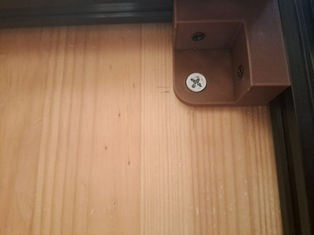

## Step - Install the Y axis rails, motor/tension mounts and Y axis motors.

The Y axis linear guide rails allow the rail slide block, and the X gantry that will be attached to it, to travel smoothly along the Y axis.

On each side of the rail an `xymm` (X+Y Motor Mount) and `btpm` (Belt Tension Pulley Mount) part will be attached to the extrusions using M5 bolts and T-nuts. After the `xymm` part is attached, turn it over and attach the motor using M3 bolts.

You can attach the rails to the extrusions using at least three M3 bolts and T-nuts.

Now attach the Y axes to the side of the `xytm` parts using M3 bolts and T-nuts, as shown in the previous step.

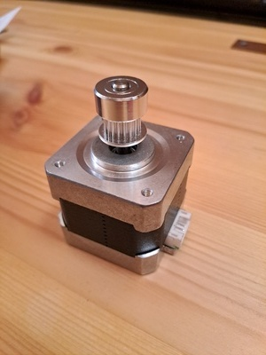
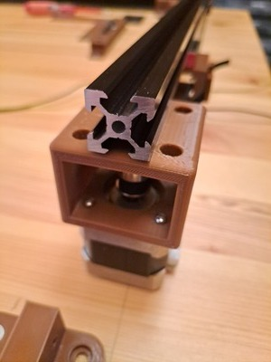

## Step - Install the remaining frame extrusions.

In order to complete the rectangular frame, attach the two remaining long extrusions to the near and far side of the `xytm` parts with M3 bolts and T-nuts and attach an `eec` to each end.

The long extrusions are used for attaching accessories.

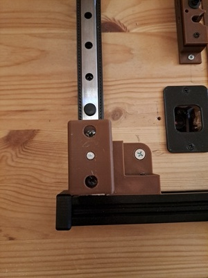

## Step - Design your work area.

The most permanent feature of the work area is the up-facing camera hole. The nozzle needs to be able to move freely over the up-facing camera, so it needs to be positioned at least 50mm above the bottom of the Y axis and at least 60mm away from the Y axis.

This is a good time to determine approximately where you want to place the PCB holder, tool changer, feeders, etc.

## Step - Cut the up-facing camera hole.

Cut the up-facing camera hole.

We cut out a ~24 x ~24mm hole by drilling multiple holes and using a chisel, because we didn't have a jigsaw available. You will get a cleaner hole with a proper saw.

## Step - Install the up-facing camera.

Place the `ufcmfp` (Up-facing Camera Mount Faceplate) on the top of the table over the up-facing camera hole and use the `ufcmfp` as a guide for drilling two 3mm holes above and below the camera hole.

Attach the camera to the `ufcm` (Up-facing Camera Mount) with M3 bolts and nuts.

Insert two long M3 bolts into `ufcmfp`, through the table, through the `ufcm` and then fasten nuts on the bottom.

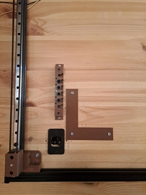

## Step - Install the X axis rail, motor/tension mount and X axis motor.

The final `xymm` and `btpm` parts are attached to each side of the final longer extrusion, the X axis extrusion, using M5 bolts and T-nuts.

Attach the X axis rail to the center of the extrusion using several M3 bolts and T-nuts.

After the `xymm` part is attached, turn it over and attach the motor using M3 bolts.

## Step - Install the X gantry.

Attach an `xgm` (X Gantry Mount) on both Y axis rail slide blocks with four M3 bolts each.

The X axis extrusion is attached on each side to an `xgm` with four M3 bolts and T-nuts. This is easier if you attach the bolts and T-nuts first, and then slide the X axis into `xgm` from one side, and then back in the opposite direction into the other `xgm`. When both ends are in place, tighten the bolts.

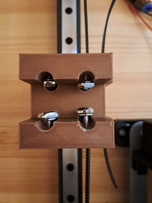

## Step - Test Y axis movement.

At this point you should test the Y axis movement and make any adjustments necessary to the rail alignment so that the X gantry can move smoothly along the Y axis.

## Step - Install the Y axis belts.

Attach screwable pulleys to the Y axis motors shafts.

Push the steel dowels partially into each `btpm` center hole, slide a bearing pulley onto the dowel, and push the steel dowel further until it's flush with the top of `btpm`.

The Y axis belts wrap around the motor pulleys on the far side, they pass through `xgm`, then wrap around the `btpm` pulleys on the near side, with the teeth facing inward.

Each end of the belts pass through the `xgm` parts, then out the side, and are fastened with `gmbc` (Gantry Mount Belt Clamp) parts, which are attached using two M3 bolts and nuts each.

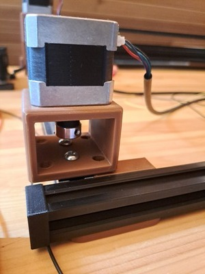
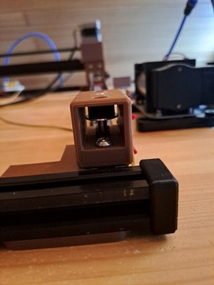

## Step - Install the X axis belt.

Attach `zgm` (Z Gantry Mount) to the X axis rail slide block with four M3 bolts, the belt end opening should face the far side of the machine.

The X axis belt wraps around the motor pulley on the right side, it passes through `zgm`, then wraps around the `btpm` pulley on the left side, with the teeth facing inward.

Each end of the belts also pass through the `zgm` part, then out the side, and are fastened with the `gmbc_dcc` (Gantry Mount Belt Clamp - Commodity Dragchain) part, which is attached using M3 bolts and nuts. This part holds the belt ends in place and provides a mount point for the dragchain.

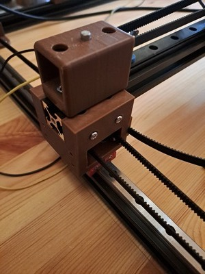
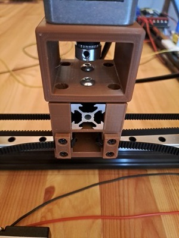

## Step - Test the machine.

It's now possible to test the X/Y movement using the motors. You might want to temporarily skip ahead and complete the limit switch and controller installation. There is a `zgmfpp` (Z Gantry Mount Faceplate Plotter) part that will let you attach a pen, and you can use an SVG to g-code converter to draw something on a sheet of paper.

## Step - Install the Z axis.

The `zgmfp` (Z Gantry Mount Faceplate) attaches to `zgm`. Before attaching, the entire Z gantry should be assembled.

This assembly is a smaller version of what you've already done three times.

Mount the two Z axis rails to the front of `zgmfp`.

Next, attach the `zam` (Z Assembly Mount) to the rails with M3 bolts.

Attach the motor to the rear of `zgmfp` with M3 bolts, so that the shaft faces the front. Attach a screwable pulley to the motor shaft.

Slide a bearing pulley onto a long (35-40mm) M5 bolt, and then insert the bolt into the bottom pulley hole. Use nuts on both sides of the spacer to adjust how far the pulley extends, which should be approximately equal to the motor pulley.

The belt wraps around the motor pulley, passes through the center of `zam`, and then wraps around the bottom pulley. The belt ends are passed back through the `zam` and out the side, where two `gmbc` parts hold them in place.

The C axis hollow shaft motor can now be attached to `zam` with M3 bolts.

On the rear side of `zgmfp`, attach the `dfcm` (Down-facing Camera Mount) and camera.

Finally, attach `zgmfp` to `zgm` with four M3 bolts and nuts.

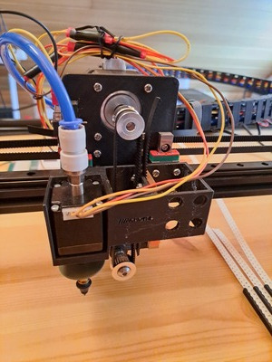

## Step - Install the drag chain.

Install the `dctc` (Drag Chain Tower - Commodity) on the far side extrusion using M5 bolts and T-nuts.

Run all wires, cables and tubes through the drag chain.

Attach one of the drag chain ends to the `dct` and the other end to the `gmbc_dcc` that is attached to `zgm`.

## Step - Install the limit switches.

Three limit switches set the zero coordinate for the X, Y and Z axes.

The max coordinates are set in the firmware.

The X/Y limit switches are connected to `lsm` (Limit Switch Mount) with M2 bolts and nuts, which is then connected to the extrusions with M3 bolts and T-nuts.

The X axis limit switch is installed on the Y axis extrusion on the right near side.

The Y axis limit switch is installed the X axis extrusion on the left side.

The Z axis limit switch is attached directly to the `zgmfp`.

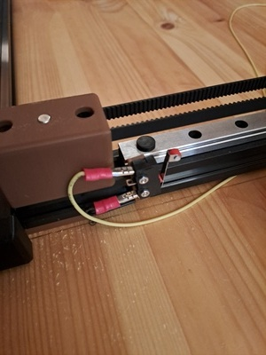

## Step - Install the controller.

The controller can be attached to the `mbe` (Mainboard Enclosure) with four M3 bolts and nuts, after it is mounted on the far side of the frame with two M3 bolts and T-nuts.

## Step - Wire the controller.

The `ppcb` (Power Plug Connection Box) can be used to wire a desktop power supply to the controller board, but there are many other possible ways to power the machine.

If using the BIGTREETECH Octopus with the Eins Marlin firmware configuration:

| Connector | Wired to |
|-----------|---------|
| MOTOR0 | X axis |
| MOTOR1 | Z axis |
| MOTOR2 1 | Y axis |
| MOTOR2 2 | Y axis |
| MOTOR3 | C axis |
| PG6 | X limit switch |
| PG9 | Y limit switch |
| PG10 | Z limit switch |
| FAN0 | Pump |
| FAN1 | Solenoid |

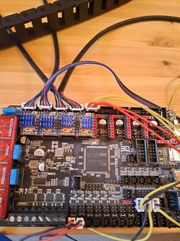

## Step - Update the firmware.

Download the Marlin 2.1 source code, install the prerequisites, and replace the configuration files with those in [machines/eins/firmware](machines/eins/firmware).

Build the firmware binary:

```
$ platformio run -e STM32F446ZE_btt_USB
```

Then copy `.pio/build/STM32F446ZE_btt_USB/firmware.bin` to a MicroSD card, plug it into the controller, and turn on the power.

## Step - Install the pneumatics.

The pump can be mounted to the top, side or bottom of the table.

The `svm` (Solenoid Valve Mount) can be used to mount the solenoid to the far side of the frame.

The pneumatic tubing should be connected from the pump inlet to the solenoid, and the solenoid to the hollow shaft motor that is attached to `zam`.
